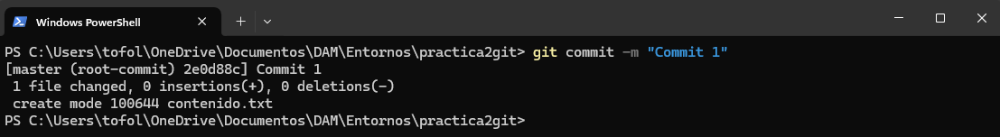
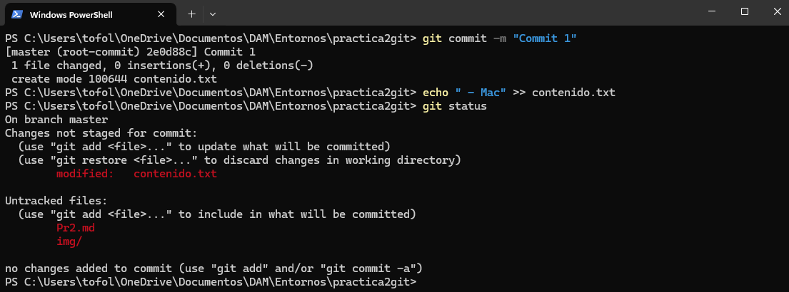
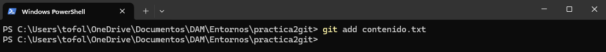
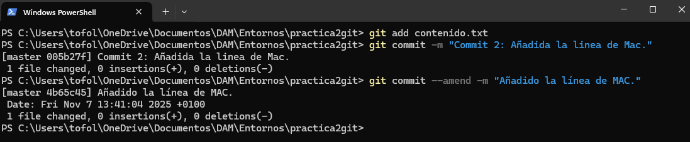
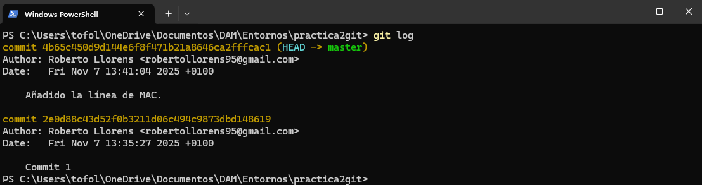

# Practica 2 - GIT

1. Cread un repositorio (directorio) llamado practica2git e inicializa el sistema de control de versiones
2. Cread un fichero llamado contenido.txt con el siguiente texto:
```
- Introducción a linea de comandos
    - Windows
    - Linux
```


3. Comprobad el estado del repositorio 


4. Añadid el fichero a la zona de preparado

Usamos "git add archivo1.txt"


5. Comprobad de nuevo el estado del repositorio

Usamos "git status"


6. Haced el primer commit con su comentario correspondiente


Usamos el comando "git commit -m "COMENTARIO""



7. Añadid la línea al fichero:
```
- Mac
``` 

Añadimos la línea con el comando "echo " - Mac" >> contenido.txt"

8. Compruebad de nuevo el estado del repositorio



9. Añadid el fichero a preparado

Usamos el comando "git add contenido.txt"



10. Haced otro commit del fichero

Usamos el comando "git commit -m "COMENTARIO.""

11. Cambiad el mensaje del último commit por “Añadido la línea de MAC.”

Para eso usaremos el comanmdo "git commit --amend -m "Añadido la línea de MAC.""



Vemos los cambios con "log"


```
Para cambiar el mensaje del commit se usa:

$git commit --amend -m "Mensaje"
```
